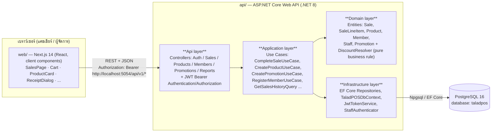

# High-Level Architecture

## ภาพรวมระบบ

TaladPOS แบ่งเป็น 2 โปรเจกต์แยกกัน คุยกันผ่าน REST API เท่านั้น (ไม่มี server-side rendering ที่เรียก DB ตรง ๆ)
คนละ repo/process กันในทาง deploy:

- **`web/`** — Next.js 14 (App Router), React 18, TypeScript, Tailwind/daisyUI — รันที่ `http://localhost:3001` (dev)
- **`api/`** — ASP.NET Core 8 Web API, EF Core 8, จัดโครงสร้างแบบ DDD (Domain / Application / Infrastructure / Api)
  — รันที่ `http://localhost:5054` (dev, ตาม `launchSettings.json` profile `http`)
- **PostgreSQL 16** — เก็บข้อมูลทั้งหมด (container `taladpos-postgres-1`)

> ทิศทางเรียก **ทางเดียว**: `web/` ไม่เคยต่อ DB ตรง และ `api/` ไม่รู้จัก UI — เป็นไปตาม
> constitution Principle I ของโปรเจกต์ (`.specify/memory/constitution.md`)

## Layer ภายใน `api/` (DDD)

| Layer | Namespace | หน้าที่ | ตัวอย่างไฟล์ |
|---|---|---|---|
| Api | `TaladPOS.Api` | รับ HTTP request, map เป็น DTO, ตรวจ `[Authorize]`, ส่งต่อให้ Application | `Controllers/SalesController.cs` |
| Application | `TaladPOS.Application` | ควบคุม use case 1 flow ทั้งหมด (business orchestration), เปิด/ปิด transaction | `Sales/CompleteSaleUseCase.cs` |
| Domain | `TaladPOS.Domain` | กฎธุรกิจล้วน ๆ ไม่รู้จัก DB/HTTP, entity + invariant | `Promotions/DiscountResolver.cs`, `Sales/Sale.cs` |
| Infrastructure | `TaladPOS.Infrastructure` | EF Core mapping, repository implementation, external service (JWT, password hash) | `Repositories/ProductRepository.cs` |

## ตาราง PostgreSQL ทั้งหมดที่ใช้งาน

ชื่อตารางกำหนดแบบ snake_case (`ToTable("...")`) แต่ **ชื่อคอลัมน์เป็น PascalCase** (ไม่ได้ตั้งค่า
snake-case naming convention ให้ EF Core) — อ้างอิงจาก `Configurations/*.cs` และไฟล์ migration ใน
`api/src/TaladPOS.Infrastructure/Persistence/Migrations/`

### `staff`
| Column | Type | หมายเหตุ |
|---|---|---|
| `Id` | uuid PK | |
| `Name` | varchar(200) | ชื่อพนักงาน |
| `Username` | varchar(100) | unique index `IX_staff_Username` |
| `PasswordHash` | text | hash (ไม่เก็บ plaintext) |
| `Role` | varchar(20) | enum เก็บเป็น string: `Manager` \| `Cashier` |

### `products`
| Column | Type | หมายเหตุ |
|---|---|---|
| `Id` | uuid PK | |
| `Name` | varchar(200) | |
| `ImageUrl` | text | |
| `Price` | numeric(12,2) | |
| `Barcode` | varchar(64), nullable | unique index (เฉพาะแถวที่ไม่ null) |
| `StockQuantity` | int | ตัดสต็อกแบบ atomic UPDATE ตอน checkout |
| `LowStockThreshold` | int | ใช้คำนวณ `IsLowStock` (computed property ฝั่ง C#, ไม่ใช่คอลัมน์) |

### `members`
| Column | Type | หมายเหตุ |
|---|---|---|
| `Id` | uuid PK | |
| `Name` | varchar(200) | |
| `PhoneNumber` | varchar(30) | unique index |
| `AccumulatedPurchaseTotal` | numeric(12,2) | บวกเพิ่มทุกครั้งที่บิลนั้นผูกกับสมาชิกคนนี้ |

### `promotions`
| Column | Type | หมายเหตุ |
|---|---|---|
| `Id` | uuid PK | |
| `Scope` | varchar(10) | enum เก็บเป็น string: `Item` \| `Bill` |
| `DiscountPercentage` | numeric(5,2) | ช่วง (0, 100] |
| `ProductId` | uuid, nullable | บังคับมีค่าเมื่อ `Scope=Item`, ต้องเป็น null เมื่อ `Scope=Bill` |
| `AppliesToMembersOnly` | bool | true = ใช้ได้เฉพาะบิลที่ผูกสมาชิก |
| `StartDate` / `EndDate` | date | ช่วงวันที่ active (inclusive ทั้งสองด้าน) |

### `sales`
| Column | Type | หมายเหตุ |
|---|---|---|
| `Id` | uuid PK | |
| `StaffId` | uuid | มาจาก JWT claim เท่านั้น (ไม่รับจาก request body) — **ไม่มี FK constraint** ไปยัง `staff` |
| `MemberId` | uuid, nullable | **ไม่มี FK constraint** ไปยัง `members` |
| `CreatedAtUtc` | timestamptz | |

> `SubtotalAmount` / `DiscountAmount` / `TotalAmount` เป็น **computed property ฝั่ง C#** (`Ignore()` ใน
> EF config) คำนวณจาก `LineItems` เสมอ ไม่ได้เก็บเป็นคอลัมน์ — กัน field 3 ตัวนี้ drift ไปจากผลรวม line items จริง

### `sale_line_items`
| Column | Type | หมายเหตุ |
|---|---|---|
| `Id` | uuid PK | |
| `SaleId` | uuid | FK → `sales.Id`, `ON DELETE CASCADE` |
| `ProductId` | uuid | **ไม่มี FK constraint** ไปยัง `products` (เก็บเป็น snapshot อ้างอิง ไม่บังคับว่า product ต้องยังอยู่) |
| `ProductNameSnapshot` | varchar(200) | ชื่อสินค้า ณ เวลาขาย (กันบิลเก่าพังถ้าสินค้าโดนแก้ชื่อ/ลบทีหลัง) |
| `UnitPriceSnapshot` | numeric(12,2) | ราคา ณ เวลาขาย |
| `Quantity` | int | |
| `DiscountAmount` | numeric(12,2) | ผลรวมส่วนลด Item-scope + ส่วนแบ่งของ Bill-scope ของ line นี้ |

`Sale` เป็น **append-only**: ไม่มี endpoint ยกเลิก/แก้ไข/ลบบิล (ตามผลการ clarify session)
