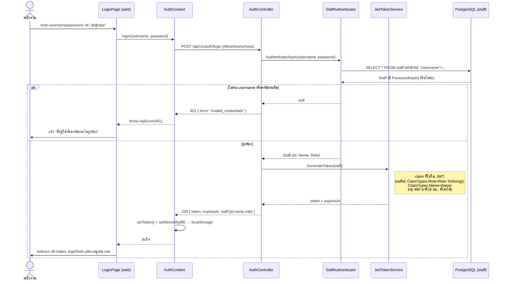
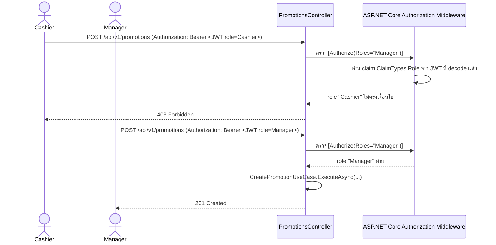

# สิทธิ์การเข้าถึง / Role-based Authorization

อ้างอิง **FR-029**: "ระบบต้องจำกัดสิทธิ์การเข้าถึงหน้าจัดการสต็อกสินค้า หน้าจัดการโปรโมชั่น และหน้ารายงาน
ให้ใช้งานได้เฉพาะบัญชีระดับผู้จัดการ/เจ้าของร้านเท่านั้น พนักงานขาย/แคชเชียร์ทั่วไปที่ล็อกอินสามารถเข้าถึง
ได้เฉพาะหน้าขายสินค้าและการค้นหา/สมัครสมาชิก" (`specs/001-single-store-pos/spec.md:199`)

## สรุปสั้น — "กำหนดสิทธิ์" ทำที่ไหน/อย่างไร

> **ไม่มีหน้าจอหรือ endpoint สำหรับสร้าง/แก้ไขพนักงาน หรือ "กำหนด/เปลี่ยน role" ขณะระบบทำงาน** — ค้นทั้ง
> `api/src/TaladPOS.Api/Controllers/` และ `api/src/TaladPOS.Application/` แล้วไม่พบ `StaffController`
> หรือ use case ใดที่สร้าง/แก้ไข `Staff` เลย มีแค่ `StaffRole.cs` (enum คงที่ 2 ค่า: `Manager`, `Cashier`)
> และบัญชีพนักงานถูกสร้างครั้งเดียวตอน dev โดย `DevelopmentSeeder.cs`
> (`api/src/TaladPOS.Infrastructure/Seed/DevelopmentSeeder.cs`) — ยืนยันจากการอ่านโค้ดจริง ไม่ใช่การเดา
> พูดอีกแบบ: **"สิทธิ์" ในระบบนี้คือ role คงที่ที่ผูกกับบัญชีตอนสร้าง ไม่ใช่ระบบ permission ที่ปรับแต่งได้**
> ถ้าต้องการเพิ่มพนักงานหรือเปลี่ยน role ในตอนนี้ต้องทำผ่าน SQL/seed script ตรง ๆ ยังไม่มี UI/API รองรับ

สิ่งที่ "กำหนดสิทธิ์" จริง ๆ ในระบบนี้คือ **การตรวจสอบ role ที่มีอยู่แล้ว** ต่อ endpoint/หน้าจอ ไม่ใช่การ
มอบหมาย role ให้ใคร — เอกสารนี้จึงเน้นอธิบาย "ใครเข้าอะไรได้บ้าง และระบบตรวจสอบยังไง"

## 1. Role ที่มีในระบบ

| Role | เก็บที่ | ความหมาย |
|---|---|---|
| `Manager` | `staff.Role` (varchar, enum เก็บเป็น string) | ผู้จัดการ/เจ้าของร้าน — เข้าได้ทุกหน้า |
| `Cashier` | เหมือนกัน | พนักงานขาย/แคชเชียร์ — เข้าได้เฉพาะขายของ+สมาชิก |

`StaffRole` enum: `api/src/TaladPOS.Domain/Staff/StaffRole.cs` — มีแค่ 2 ค่านี้ ไม่มี role อื่น (ไม่มี
"Owner", "Admin" แยกต่างหาก) `Staff.Role` เป็น `private set` และไม่มี method `ChangeRole()` บน entity —
**เปลี่ยน role ของพนักงานที่มีอยู่แล้วไม่ได้ผ่าน API ปัจจุบัน**

## 2. UI/หน้าจอที่เกี่ยวข้องกับสิทธิ์

| Component/หน้า | ไฟล์ | บทบาท |
|---|---|---|
| `AppShell` | `web/src/components/AppShell.tsx` | กรองเมนู navigation ตาม `staff.role` — Cashier เห็นแค่ "ขายสินค้า"/"ประวัติการขาย", Manager เห็นเพิ่ม "จัดการสต็อก"/"โปรโมชั่น"/"รายงาน" |
| `ManagerOnly` | `web/src/components/ManagerOnly.tsx` | การ์ดข้อความ "หน้านี้เปิดให้เฉพาะผู้จัดการ" + ลิงก์กลับหน้าขาย |
| `/stock` | `app/(protected)/stock/page.tsx:56-58` | เช็ค `if (staff?.role !== "Manager") return <ManagerOnly />` ก่อน render เนื้อหาจริง |
| `/promotions` | `app/(protected)/promotions/page.tsx:41-43` | เช็คแบบเดียวกัน |
| `/reports` | `app/(protected)/reports/page.tsx:71-73` | เช็คแบบเดียวกัน (และ `useEffect` ที่โหลดข้อมูลก็เช็คซ้ำอีกชั้นที่บรรทัด 58 — ไม่ยิง API รายงานถ้าไม่ใช่ Manager) |
| `ProtectedLayout` | `app/(protected)/layout.tsx` | ชั้นนอกสุด — เช็คแค่ "ล็อกอินหรือยัง" (มี `staff` ใน context ไหม) ไม่เช็ค role ที่ชั้นนี้ |

**ข้อควรระวัง:** การเช็ค role ทั้งหมดข้างบนอยู่ **ฝั่ง client (React)** ทำเพื่อ UX เท่านั้น (ซ่อนเมนู/กันคน
เข้าหน้าผิดโดยไม่ตั้งใจ) **ไม่ใช่ชั้นความปลอดภัยจริง** — เพราะเป็นแค่ JavaScript ที่รันในเบราว์เซอร์ของผู้ใช้
คนที่มีความรู้พอจะแก้ `localStorage`/เรียก API ตรง ๆ ผ่าน DevTools หรือ curl ก็ข้ามการเช็คนี้ไปได้ ชั้นที่
บังคับใช้จริงคือฝั่ง `api/` (หัวข้อ 4)

## 3. Login flow — ที่มาของ role บนฝั่ง client

## 4. การบังคับสิทธิ์จริง — ฝั่ง API (ชั้นที่นับจริง)

`api/src/TaladPOS.Api/Program.cs:83-90`: ทุก endpoint ต้องล็อกอินก่อนโดย **default** (fallback policy
`RequireAuthenticatedUser()`) — endpoint ที่ยกเว้นต้องมี `[AllowAnonymous]` ระบุไว้ชัดเจน (มีที่เดียวคือ
`POST /api/v1/auth/login`) endpoint ที่ต้องเป็น Manager เท่านั้นต้อง **opt-in เพิ่ม**
`[Authorize(Roles = nameof(StaffRole.Manager))]`

### ตารางสิทธิ์ต่อ endpoint (อ่านจาก attribute จริงในแต่ละ Controller)

| Controller | Endpoint | ต้องล็อกอิน? | Role ที่เข้าได้ |
|---|---|---|---|
| `AuthController` | `POST /api/v1/auth/login` | ไม่ต้อง (`[AllowAnonymous]`) | ทุกคน (ยังไม่ล็อกอิน) |
| `SalesController` | `POST/GET /api/v1/sales`, `GET /{id}`, `GET /{id}/receipt` | ต้อง | **Manager + Cashier** (ไม่มี `[Authorize(Roles=...)]` เพิ่ม) |
| `MembersController` | `GET/POST /api/v1/members`, `GET /{id}` | ต้อง | **Manager + Cashier** |
| `ProductsController` | `GET /api/v1/products`, `GET /{id}` | ต้อง | **Manager + Cashier** |
| `ProductsController` | `POST/PUT/DELETE /api/v1/products...` | ต้อง | **Manager เท่านั้น** (`[Authorize(Roles = "Manager")]` ต่อ action) |
| `PromotionsController` | ทุก endpoint (`GET/POST/PUT/DELETE`) | ต้อง | **Manager เท่านั้น** (attribute ระดับ class) |
| `ReportsController` | ทุก endpoint (`sales`, `best-selling-products`, `sales-by-staff`, `stock`) | ต้อง | **Manager เท่านั้น** (attribute ระดับ class) |

ตรงกับสิ่งที่ FR-029 ระบุ: หน้าสต็อก/โปรโมชั่น/รายงานเป็น Manager-only, ส่วนขายของ+สมาชิกใช้ได้ทั้งสอง role
(สังเกตว่า **การเขียน/แก้ไขสินค้า** (`POST/PUT/DELETE /api/v1/products`) ก็เป็น Manager-only ด้วย แม้ FR-029
จะพูดถึง "หน้าจัดการสต็อก" เฉย ๆ — endpoint นี้คือ backend ของหน้านั้น)

### Sequence diagram: คำขอเดียวกัน ยิงโดยสอง role ไป endpoint Manager-only

> **หมายเหตุความครบถ้วนของ test:** พบ integration test ที่ยืนยัน 401 เมื่อไม่แนบ token เลย
> (`AuthTests.PostSales_WithoutAuthorizationHeader_Returns401`, `api/tests/TaladPOS.Api.IntegrationTests/AuthTests.cs`)
> แต่ **ไม่พบ test ที่ยืนยัน 403 โดยตรง** เมื่อบัญชี Cashier เรียก endpoint ที่ล็อก `Roles="Manager"`
> พฤติกรรม 403 ข้างบนมาจาก mechanism มาตรฐานของ ASP.NET Core `[Authorize(Roles=...)]` เอง (ตรวจสอบจาก
> framework behavior + `Program.cs` ไม่ใช่จาก test ที่ยืนยันไว้ในโค้ดนี้) — ถ้าจะเพิ่มความมั่นใจ ควรเพิ่ม
> integration test คู่นี้ไว้ใน `AuthTests.cs`

## 5. `staffId` ในบิล มาจากไหน (เกี่ยวโยงกับสิทธิ์)

`SalesController.GetStaffIdFromClaims()` อ่าน `staffId` จาก JWT claim เท่านั้น — **ไม่รับ** `staffId` จาก
request body แม้ client จะส่งมา (ดูตัวอย่างการยืนยันพฤติกรรมนี้ใน
`api/tests/TaladPOS.Api.IntegrationTests/SalesAttributionTests.cs`) กันไม่ให้ Cashier คนหนึ่งปลอมว่าอีก
คนเป็นคนขายบิลนั้น

## 6. เคสที่มักเข้าใจผิด

| คำถาม | คำตอบ |
|---|---|
| กด "กำหนดสิทธิ์" ให้พนักงานคนหนึ่งได้จากที่ไหน? | **ไม่มีในระบบตอนนี้** — ไม่มีหน้าจอ/endpoint จัดการพนักงาน มีแค่ role คงที่จากตอนสร้างบัญชี (ปัจจุบันมีแค่ dev seed 2 บัญชี: `manager`/`cashier`) |
| ซ่อนเมนู Manager บนหน้าเว็บแล้ว ปลอดภัยหรือยัง? | **ยัง** — เป็นแค่ UX การบังคับจริงอยู่ที่ `[Authorize(Roles=...)]` ฝั่ง `api/` เท่านั้น (หัวข้อ 4) |
| Token หมดอายุระหว่างใช้งาน จะเกิดอะไรขึ้น? | `apiFetch()` (`web/src/lib/api/client.ts`) จะได้ 401 กลับมาเป็น `ApiError` เฉย ๆ **ไม่มี interceptor ที่ auto-logout/พาไปหน้า login อัตโนมัติ** — ตอนนี้มีการจัดการ 401 แบบเจาะจงแค่ที่หน้า login (รหัสผ่านผิด) จุดอื่นจะเห็นเป็น error message ทั่วไปของแต่ละหน้าเท่านั้น (ควรยืนยัน/ปรับปรุงจุดนี้กับทีมถ้าเป็นปัญหาในการใช้งานจริง) |
| Manager กับ Cashier ต่างกันที่ endpoint ขายของไหม? | ไม่ต่าง — `POST /api/v1/sales` และ endpoint สมาชิกใช้ได้ทั้งสอง role เหมือนกันทุกประการ ต่างกันแค่หน้าสต็อก/โปรโมชั่น/รายงาน และ CRUD สินค้า |
