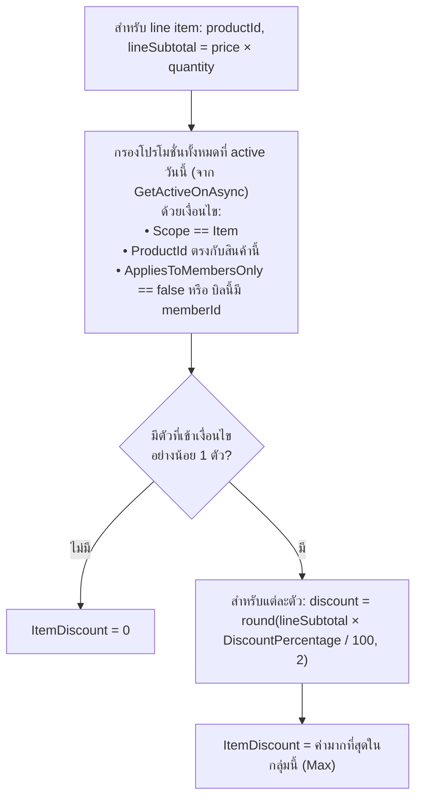
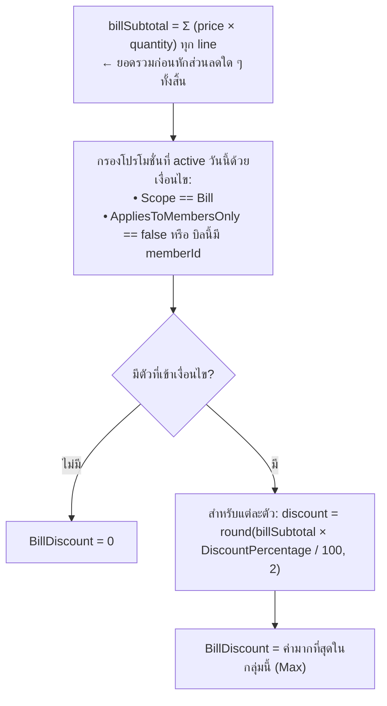
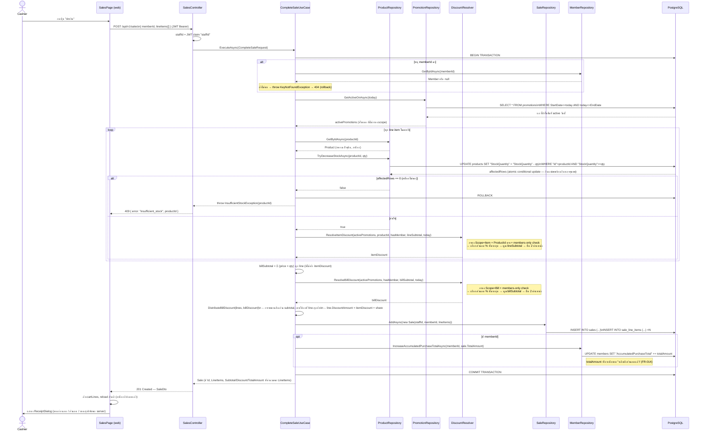

# การคำนวณโปรโมชั่น / ส่วนลด

ส่วนลดทั้งหมดคำนวณ **ฝั่ง `api/` เท่านั้น** ตอนปิดบิล (`POST /api/v1/sales`) — ไม่มีการ preview
ส่วนลดที่แม่นยำระหว่างช้อป (ดู [`sales-screen.md`](./sales-screen.md) หัวข้อ 2)

โค้ดหลักที่เกี่ยวข้อง (ทั้งหมดอยู่ใต้ `api/src/`):

| ไฟล์ | หน้าที่ |
|---|---|
| `TaladPOS.Domain/Promotions/Promotion.cs` | Entity โปรโมชั่น + validation (`DiscountPercentage` ต้องอยู่ใน (0,100], `Scope=Item` ต้องมี `ProductId`, `Scope=Bill` ต้องไม่มี) |
| `TaladPOS.Domain/Promotions/DiscountResolver.cs` | **กฎการเลือกโปรโมชั่น** — static, pure function, ไม่แตะ DB |
| `TaladPOS.Application/Sales/CompleteSaleUseCase.cs` | Orchestrate ทั้ง flow ปิดบิล: ตัดสต็อก → เรียก DiscountResolver → กระจายส่วนลดบิลลง line → บันทึก |
| `TaladPOS.Infrastructure/Repositories/PromotionRepository.cs` | ดึงโปรโมชั่นที่ active วันนี้จาก DB |

## 1. โครงสร้างโปรโมชั่น (`Promotion`)

> **สรุปสั้น — โปรโมชั่นมีกี่แบบ เก็บไว้ที่ไหน:** มี **2 ชนิดตาม `Scope`** เท่านั้น คือ `Item`
> (ลดสินค้าชิ้นเดียว) กับ `Bill` (ลดทั้งบิล) — เก็บทั้งคู่ในตารางเดียวกันคือ **`promotions`** ใน
> PostgreSQL (ดูคอลัมน์ทั้งหมดที่ [`architecture.md`](./architecture.md#promotions)) ไม่ได้แยกตาราง
> ตามชนิด ส่วน "เฉพาะสมาชิก" (`AppliesToMembersOnly`) **ไม่ใช่ชนิดที่ 3** แต่เป็น flag แยกที่ผูกกับ
> โปรโมชั่นชนิดไหนก็ได้ (เช่น "Item ลด 10% เฉพาะสมาชิก" หรือ "Bill ลด 5% เฉพาะสมาชิก")

| Field | ความหมาย |
|---|---|
| `Scope` | `Item` (ผูกกับสินค้าชิ้นเดียว) หรือ `Bill` (ลดทั้งบิล) — enum เก็บเป็น string ในคอลัมน์ `Scope` |
| `DiscountPercentage` | เปอร์เซ็นต์ส่วนลด (0, 100] |
| `ProductId` | บังคับมีค่าเมื่อ `Scope=Item`, ต้องเป็น `null` เมื่อ `Scope=Bill` |
| `AppliesToMembersOnly` | ถ้า `true` ใช้ได้เฉพาะบิลที่ระบุ `memberId` เท่านั้น — เป็น flag ไม่ใช่ scope แยก (ดูกล่องสรุปด้านบน) |
| `StartDate` / `EndDate` | active เมื่อ `StartDate <= วันนี้ <= EndDate` (รวมทั้งสองวัน) |

Entity: `api/src/TaladPOS.Domain/Promotions/Promotion.cs` — validation ทั้งหมดอยู่ใน `Promotion.Validate()`
(บรรทัด 71-94) เช่น `DiscountPercentage` ต้องอยู่ในช่วง (0,100], `EndDate >= StartDate`

จัดการผ่านหน้า **"โปรโมชั่น"** (`web/src/app/(protected)/promotions/page.tsx` + `PromotionFormDialog.tsx`)
ซึ่งเป็นเมนูที่จำกัดเฉพาะ **Manager** เท่านั้น (`[Authorize(Roles = "Manager")]` ทั้ง controller) ผ่าน
endpoint `GET/POST/PUT/DELETE /api/v1/promotions` (`PromotionsController.cs`)

## 2. กฎการเลือกโปรโมชั่น (`DiscountResolver`)

> **กฎเดียว ท่องไว้ตัวเดียว**: ภายใน scope เดียวกัน (Item หรือ Bill) ถ้ามีโปรโมชั่นเข้าเงื่อนไขพร้อมกัน
> หลายตัว **เลือกตัวที่คำนวณแล้วให้จำนวนเงินส่วนลดมากที่สุดเพียงตัวเดียว ไม่บวกสะสมกัน**
> แต่ส่วนลดระดับ **Item** และระดับ **Bill** เป็นคนละ scope กัน จึง **รวมกันได้** บน line เดียวกัน

### 2.1 ส่วนลดระดับสินค้า (Item-scope) — ต่อ 1 line item



### 2.2 ส่วนลดระดับบิล (Bill-scope) — คำนวณครั้งเดียวต่อทั้งบิล



**ข้อสังเกตสำคัญ:** `billSubtotal` ที่ใช้คำนวณ Bill-scope คือยอดรวม**ก่อน**หักส่วนลด Item-scope ใด ๆ
(ดู `CompleteSaleUseCase.cs` บรรทัด `billSubtotal = pendingLines.Sum(l => l.Subtotal)` ซึ่ง `Subtotal`
คือ `UnitPrice × Quantity` เท่านั้น ไม่ลบ `ItemDiscount` ออกก่อน)

### 2.3 กระจายส่วนลดระดับบิลลงแต่ละ line (`DistributeBillDiscount`)

เพราะ `SaleLineItem` แต่ละแถวเก็บ `DiscountAmount` เป็นตัวเลขเดียว (ไม่มีคอลัมน์แยก item/bill) และ
`Sale.DiscountAmount` = ผลรวม `DiscountAmount` ของทุก line (ไม่ใช่คอลัมน์ที่เก็บจริง — เป็น computed
property) ส่วนลดระดับบิลจึงต้องถูก "หาร" ลงแต่ละ line ตามสัดส่วนยอดของ line นั้น:

```
share(line) = round(BillDiscount × line.Subtotal / billSubtotal, 2)   — สำหรับทุก line ยกเว้น line สุดท้าย
share(line สุดท้าย) = BillDiscount − Σ share ของ line ก่อนหน้าทั้งหมด  — กันเศษสตางค์จากการปัดเศษหาย/เกิน

line.DiscountAmount = ItemDiscount(line) + share(line)
```

การให้ line สุดท้ายรับเศษที่เหลือ ทำให้ `Σ line.DiscountAmount == BillDiscount + Σ ItemDiscount` เป๊ะ
เสมอ ไม่มีเศษสตางค์หายหรือเกินจากการปัดเศษ (มี unit test คุมพฤติกรรมนี้โดยตรงใน
`CompleteSaleUseCaseTests.ExecuteAsync_WithActiveBillPromotion_DistributesDiscountAcrossAllLines`)

หากไม่มี Bill-scope discount เลย (`BillDiscount == 0`) จะข้ามการกระจายทั้งหมด แต่ละ line ใช้แค่
`ItemDiscount` ของตัวเอง

## 3. Sequence Diagram: ปิดบิล (Checkout) แบบเต็ม



ทุกขั้นตอนข้างบน (ตัดสต็อก, บันทึกบิล, อัปเดตยอดสะสมสมาชิก) อยู่ใน **database transaction เดียวกัน**
— ถ้าขั้นใดขั้นหนึ่งล้มเหลว (เช่น สต็อกไม่พอสำหรับสินค้าตัวที่ 2 ในตะกร้า) ทุกอย่างจะ rollback หมด
ไม่มีสถานะครึ่ง ๆ กลาง ๆ (ตัดสต็อกไปแล้วแต่ไม่บันทึกบิล เป็นต้น)

## 4. ตัวอย่างตัวเลขจริง (จาก unit test ใน `CompleteSaleUseCaseTests.cs`)

### ตัวอย่างที่ 1 — โปรโมชั่นระดับสินค้า (Item)

ตะกร้า: มะม่วง 45.00 × 2, แอปเปิ้ล 60.00 × 1 — มีโปรโมชั่น "มะม่วงลด 10%" (`Scope=Item`, ผูกกับมะม่วง)

| | คำนวณ | ผลลัพธ์ |
|---|---|---|
| Line มะม่วง subtotal | 45.00 × 2 | 90.00 |
| Line มะม่วง discount | 90.00 × 10% | **9.00** |
| Line แอปเปิ้ล discount | ไม่มีโปรโมชั่นของสินค้านี้ | **0.00** |
| `Sale.DiscountAmount` | 9.00 + 0.00 | **9.00** |
| `Sale.TotalAmount` | (90.00+60.00) − 9.00 | **141.00** |

### ตัวอย่างที่ 2 — โปรโมชั่นระดับบิล (Bill)

ตะกร้าเดิม (รวม 150.00) — เปลี่ยนเป็นโปรโมชั่น "ลดทั้งบิล 10%" (`Scope=Bill`, ไม่ผูก member)

| | คำนวณ | ผลลัพธ์ |
|---|---|---|
| `billSubtotal` | 90.00 + 60.00 | 150.00 |
| `BillDiscount` | 150.00 × 10% | 15.00 |
| ส่วนแบ่งมะม่วง | round(15.00 × 90/150, 2) | 9.00 |
| ส่วนแบ่งแอปเปิ้ล (line สุดท้าย = เศษที่เหลือ) | 15.00 − 9.00 | 6.00 |
| `Sale.DiscountAmount` | 9.00 + 6.00 | **15.00** (ตรงกับ `BillDiscount` เป๊ะ) |
| `Sale.TotalAmount` | 150.00 − 15.00 | **135.00** |

### ตัวอย่างที่ 3 — โปรโมชั่นเฉพาะสมาชิก (`AppliesToMembersOnly = true`)

โปรโมชั่น "สมาชิกลด 20%" ผูกกับมะม่วง (45.00 × 1):

- **บิลไม่ผูกสมาชิก** (`memberId = null`) → `hasMember = false` → โปรโมชั่นนี้ไม่เข้าเงื่อนไข →
  `DiscountAmount = 0.00`
- **บิลผูกสมาชิก** → `hasMember = true` → เข้าเงื่อนไข → `DiscountAmount = 45.00 × 20% = 9.00`

## 5. เคสที่มักเข้าใจผิด

| คำถาม | คำตอบ |
|---|---|
| ถ้ามีโปรโมชั่น Item 10% + Bill 5% พร้อมกัน ลดรวมกี่ %? | ลดทั้งสองซ้อนกันได้ (คนละ scope) — line ที่โดนทั้งคู่จะได้ `itemDiscount + ส่วนแบ่ง billDiscount` |
| มีโปรโมชั่น Item ของสินค้าเดียวกัน 2 ตัวพร้อมกัน (เช่น 10% กับ 15%) จะได้ลดกี่ %? | ได้แค่ตัวที่ให้ส่วนลด**เป็นเงิน**มากกว่า (ในที่นี้คือ 15%) ตัวเดียว ไม่ใช่ 25% |
| โปรโมชั่นที่ `EndDate` เป็นเมื่อวาน ยังใช้ได้ไหม? | ไม่ได้ — เช็คด้วย `StartDate <= today <= EndDate` แบบ inclusive ที่ **`today` ฝั่งเซิร์ฟเวอร์ (UTC)** ตอนกดชำระเงินจริง ไม่ใช่ตอนเปิดหน้าตะกร้า |
| หน้าตะกร้าโชว์ราคาหลังหักส่วนลดระหว่างช้อปไหม? | **ไม่** — โชว์แค่ราคารวมดิบ ส่วนลดจริงรู้ตอนได้ response จาก `POST /api/v1/sales` เท่านั้น |
