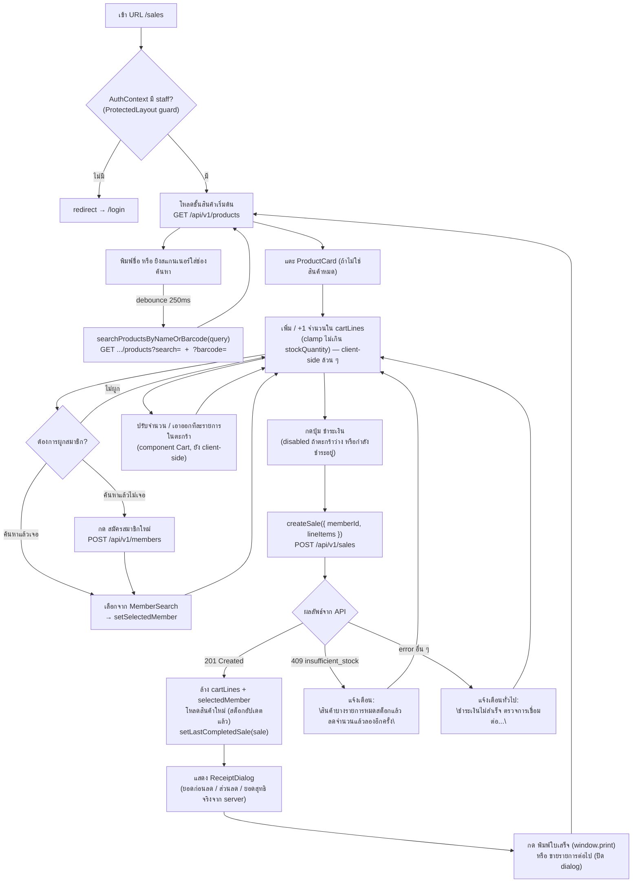

# หน้าขายสินค้า (`/sales`)

ไฟล์หลัก: `web/src/app/(protected)/sales/page.tsx` (component `SalesPage`)
อยู่ใน route group `(protected)` → ต้องผ่าน guard ที่ `web/src/app/(protected)/layout.tsx` ก่อนเสมอ
(เช็ค `useAuth()`; ถ้าไม่มี `staff` ใน context → `router.replace("/login")`)

## 1. Component บนหน้าจอ

| Component | ไฟล์ | หน้าที่ |
|---|---|---|
| `SalesPage` | `app/(protected)/sales/page.tsx` | เก็บ state หลักทั้งหมดของหน้า (query, products, cartLines, selectedMember, ...) และ orchestrate ทุกอย่าง |
| `ProductCard` | `components/ProductCard.tsx` | การ์ดสินค้า 1 ชิ้นบนชั้นวาง กดเพื่อเพิ่มลงตะกร้า, ปิดปุ่มถ้า `isOutOfStock`, โชว์ badge "เหลือ N" ถ้า `isLowStock` |
| `Cart` | `components/Cart.tsx` | แผงตะกร้าฝั่งขวา (บนมือถือเป็น bottom sheet) — รายการสินค้าในบิล, ปุ่ม +/− จำนวน, ค้นหา/เลือกสมาชิก, ยอดรวม, ปุ่มชำระเงิน |
| `MemberSearch` | `components/MemberSearch.tsx` | combobox ค้นหาสมาชิกด้วยชื่อ/เบอร์โทร (debounce 250ms) |
| `MemberFormDialog` | `components/MemberFormDialog.tsx` | ฟอร์ม modal สมัครสมาชิกใหม่ตรงจุดขาย |
| `ReceiptDialog` / `Receipt` | `components/ReceiptDialog.tsx`, `components/Receipt.tsx` | โชว์ใบเสร็จหลังชำระเงินสำเร็จ + ปุ่มพิมพ์ (`window.print()`) |

## 2. State หลักของ `SalesPage`

```
query            — ข้อความในช่องค้นหา/สแกน
products         — ผลค้นหาสินค้าที่แสดงบนชั้นวาง (จาก API เสมอ ไม่ cache ยาว)
cartLines        — ตะกร้า: [{ product, quantity }]  ← อยู่ฝั่ง client ล้วน ๆ ยังไม่ส่งอะไรไป backend
selectedMember   — สมาชิกที่ผูกกับบิลนี้ (optional)
isCheckingOut    — สถานะกำลังยิง POST /api/v1/sales
lastCompletedSale— ผลลัพธ์ Sale ที่เพิ่งปิดบิลสำเร็จ (ใช้โชว์ใบเสร็จ)
```

**สำคัญ:** ยอดเงินที่เห็นใน `Cart` ระหว่างช้อปคือ
`subtotal = Σ (product.price × quantity)` **เท่านั้น** — เป็นการคำนวณฝั่ง client แบบดิบ ๆ
**ไม่มีส่วนลดโปรโมชั่นเข้ามาเกี่ยวข้องเลยในขั้นตอนนี้** ตัวเลขส่วนลด/ยอดสุทธิที่ถูกต้องจะรู้ก็ต่อเมื่อ
เซิร์ฟเวอร์ตอบกลับหลังกดชำระเงินเท่านั้น (ดู [`promotion-discount.md`](./promotion-discount.md))

## 3. API ที่หน้านี้เรียก

| Action บนจอ | ฟังก์ชัน (`web/src/lib/api/*.ts`) | HTTP | Endpoint |
|---|---|---|---|
| พิมพ์/สแกนในช่องค้นหา (debounce 250ms) | `searchProductsByNameOrBarcode()` → `searchProducts()` | GET | `/api/v1/products?search=...` และ `/api/v1/products?barcode=...` (ยิงคู่ขนาน แล้ว merge, ผลจาก barcode ขึ้นก่อน) |
| พิมพ์ค้นหาสมาชิก | `searchMembers()` (ใน `MemberSearch`) | GET | `/api/v1/members?search=...` |
| กด "สมัครสมาชิกใหม่" แล้ว submit ฟอร์ม | `registerMember()` | POST | `/api/v1/members` |
| กดปุ่ม **"ชำระเงิน"** | `createSale()` | POST | `/api/v1/sales` |
| หลังชำระเงินสำเร็จ (รีเฟรชชั้นสินค้าให้สต็อกอัปเดต) | `searchProductsByNameOrBarcode(query)` | GET | `/api/v1/products?...` (เรียกซ้ำ) |

ทุก request แนบ header `Authorization: Bearer <JWT>` โดยอัตโนมัติผ่าน `apiFetch()` ใน
`web/src/lib/api/client.ts` (อ่าน token จาก `tokenStore` ที่เก็บใน `localStorage` ตอน login)

## 4. Flow diagram ของทั้งหน้าจอ



## 5. Role-based behavior บนหน้านี้

- หน้าขายสินค้าใช้ได้ทั้ง `Cashier` และ `Manager` (endpoint `POST /api/v1/sales` ไม่ได้ล็อก role เฉพาะ
  Manager เหมือน endpoint จัดการสินค้า/โปรโมชั่น)
- `staffId` ผู้ขายที่บันทึกลงบิล **มาจาก JWT claim `staffId` เท่านั้น** — ฝั่ง client ไม่ได้ส่งค่านี้มาเอง
  (`SalesController.GetStaffIdFromClaims()`) ป้องกันการปลอมแปลงว่าใครเป็นคนขาย
- เมนู/ปุ่มที่ผูกกับสิทธิ์ Manager เท่านั้น (จัดการสต็อก, โปรโมชั่น) ถูกซ่อน/บล็อกด้วย component
  `ManagerOnly.tsx` ที่ layer อื่น ไม่เกี่ยวกับหน้า `/sales` โดยตรง
